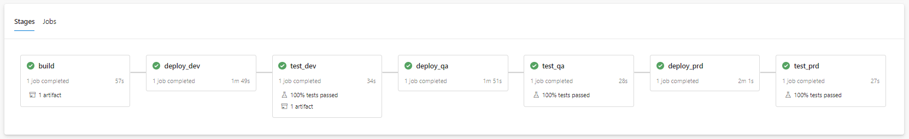

# Variable management with variable template files using Azure Pipelines

## Overview

This sample app demonstrates the use of variable template files in Azure Pipelines. It creates a sample python application with Flask and deploys it to Azure Web App for three different environments, `'dev'`, `'qa'` and `'prd'`.

### Variable Templates

Variable template files allow you to group pipeline variables. This grouping can be based on environments, applications, stages, etc. This sample app groups the variables by environments and has global variables defined in `vars-global.yaml`.

Using variable templates allows the variables to be maintained in the source code. If you're planning to store any secrets please consider using [Variable Groups](https://docs.microsoft.com/en-us/azure/devops/pipelines/library/variable-groups?view=azure-devops&tabs=yaml). For more details on variable templates, please see the [documentation here](https://docs.microsoft.com/en-us/azure/devops/pipelines/yaml-schema?view=azure-devops&tabs=schema%2Cparameter-schema#variable-templates)

## Getting Started

### Folder Structure

Here's the folder structure for the sample:

- `build`
  - `vars` - variable templates
    - `vars-global.yaml` - global variables for all environments
    - `vars-dev.yaml` - variables for `dev` environment
    - `vars-qa.yaml` - variables for `qa` environment
    - `vars-prd.yaml` - variables for `prd` environment
  - `azure-pipelines.yaml` - Main Azure Pipelines yaml file to create pipeline
  - `steps-build.yaml` - Build steps for the pipeline
  - `steps-deployment.yaml` - Deployment steps for the pipeline
  - `steps-tests.yaml` - Test steps for the pipeline
- `web-app`
  - `src`
    - `app.py` - Simple flask template to validate CI/CD scenario
  - `tests`
    - `conftest.py` - Test configuration file to handle arguments
    - `test_integration.py` - Simple flask integration test sample to validate CI/CD scenario
  - `requirements.txt` - Required pip packages to run python flask app on your local and pipeline
  - `requirements_dev.txt` - Required pip packages to run python flask app tests on your local and pipeline

### Prerequisites

- [Azure CLI](https://docs.microsoft.com/en-us/cli/azure/install-azure-cli?view=azure-cli-latest)
- [Azure Subscription](https://docs.microsoft.com/en-us/azure/cost-management-billing/manage/create-subscription#:~:text=Create%20Subscription%20Azure%201%20Sign%20in%20to%20the,for%20each%20type%20of%20billing%20account.%20See%20More.)
- [Azure Resource Group](https://docs.microsoft.com/en-us/azure/azure-resource-manager/management/manage-resource-groups-portal#:~:text=Create%20resource%20groups%201%20Sign%20in%20to%20the,newly%20created%20resource%20group%20to%20open%20it.)
- [Github Account](https://github.com/)
- [Latest Stable Python Version](https://www.python.org/downloads/)
- [Azure Devops Account](https://www.dev.azure.com/) with an available project to house the deployment pipeline.

### Running the Sample

To run this sample, follow the steps below:

1. Fork the repo to your Github account and git clone.

2. Have an azure devops project, azure subscription, and azure resource group available.

3. Create a new Azure Resource Manager service connection or follow [this guide here](https://docs.microsoft.com/en-us/azure/devops/pipelines/library/connect-to-azure?view=azure-devops) on how to create it.

4. Open the `build/vars` folder, go to `vars-global.yaml` and change the values for the following variables:

   - `resourceGroup`: the resource group which was created with the step above
   - `location`: location of where the Azure web app resource should be created
   - `WebApp`: provide the name of the web application to be used when deploying on azure app service.

5. Open the `build/vars` folder, go to each environment variable yaml file (dev, qa, prd), and change the value of the environment variables:

   - `azureServiceConnection`: provide the name of the created [Azure Resource Manager](https://docs.microsoft.com/en-us/azure/devops/pipelines/library/connect-to-azure?view=azure-devops) service connection. This is provided as environment variable as you may have different subscriptions per environment.

6. After changing variables commit your changes to reflect into pipeline.

7. Create your pipeline in Azure Pipelines using existing `azure-pipelines.yaml` file. For more instructions on how to create a pipeline, please see [this guide](https://docs.microsoft.com/en-us/azure/devops/pipelines/create-first-pipeline?view=azure-devops&tabs=python%2Ctfs-2018-2%2Cbrowser#create-your-first-python-pipeline)

8. Run your pipeline. The pipeline output of a successful run will look like below:

   

## Code Sample

In this code sample, you'll see how to manage environment variables using variable templates for three different environments, `'dev'`, `'qa'` and `'prd'`. Sample contains a sample python application with Flask and deploys it to Azure Web App for three different environments. Pipeline builds a package, we're using that package to deploy and run integration test in each environment.

To understand variable syntax you can check [Understand variable syntax](https://docs.microsoft.com/en-us/azure/devops/pipelines/process/variables?view=azure-devops&tabs=yaml%2Cbatch#understand-variable-syntax) documentation.

### Creating and Using Variable Templates

To create a variable template, define a yaml file with the keyword `variables` at the top and use `key:value` pairs to define the variables.

```yaml
variables:
  environmentName: "dev"
  vmImageName: "ubuntu-latest"
  webAppName: "nestedyamltemplates-dev"
  azureServiceConnection: "nestedyamltemplates"
```

To use different variable templates per environment in `azure-pipelines.yaml` we're providing variable templates like below.

```yaml
# In this loop, the template references an env parameter which in this case is dev, qa or prd.
- ${{ each env in parameters.environments }}:
    - stage: test_${{ env }}
      jobs:
        - job: run_test
          variables:
            # Using this variable, the template references the correct variable template file (vars-dev.yaml, vars-qa.yaml or vars-prd.yaml) from the vars folder.
            - template: vars/vars-${{ env }}.yaml
          steps:
            - template: steps-tests.yaml
```

To use the variables that are defined in the variable templates, a template expression variable syntax can be used and referenced through `${{variables.varname}}`. For example:

```yaml
- template: steps-deployment.yaml
  parameters:
    azureServiceConnection: ${{ variables.azureServiceConnection  }}
    webAppName: ${{ variables.webAppName  }}
```

## Additional Notes

- This is a basic and linear pipeline. The only gates are the integration tests passing in each stage. See the [documentation here](https://docs.microsoft.com/en-us/azure/devops/pipelines/release/?view=azure-devops) for other pipeline patterns to create a more robust pipeline with options for gating, parallel deployments, etc.

### Referencing Variables

Azure Pipelines supports three different ways to reference variables:

- `macro expression`
- `template expression`
- `runtime expression`

In a pipeline, template expression variables `(${{ variables.var }})` get processed at compile time, before runtime starts. Macro syntax variables `($(var))` get processed during runtime before a task runs. Runtime expressions `($[variables.var])` also get processed during runtime but were designed for use with conditions and expressions. When you use a runtime expression, it must take up the entire right side of a definition.

## References

- [Azure Pipelines documentation](https://docs.microsoft.com/en-us/azure/devops/pipelines/)
- [Understanding Azure DevOps Variables](https://adamtheautomator.com/azure-devops-variables)
- [Configuring CI/CD Pipelines as Code with YAML in Azure DevOps](https://azuredevopslabs.com/labs/azuredevops/yaml/)
- [Using secrets from Azure Key Vault in a pipeline](https://azuredevopslabs.com/labs/vstsextend/azurekeyvault)

## License

See [LICENSE](LICENSE).

## Code of Conduct

This project has adopted the [Microsoft Open Source Code of Conduct](https://opensource.microsoft.com/codeofconduct/). For more information see the [Code of Conduct FAQ](https://opensource.microsoft.com/codeofconduct/faq/) or contact [opencode@microsoft.com](mailto:opencode@microsoft.com) with any additional questions or comments.

## Contributing

See [CONTRIBUTING](CONTRIBUTING).
