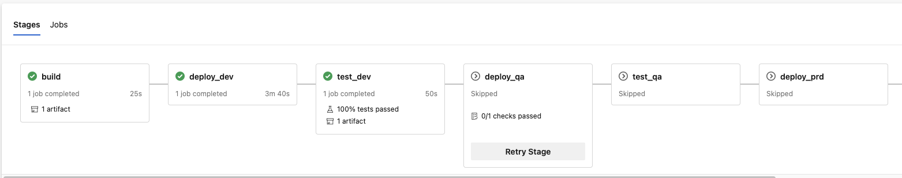
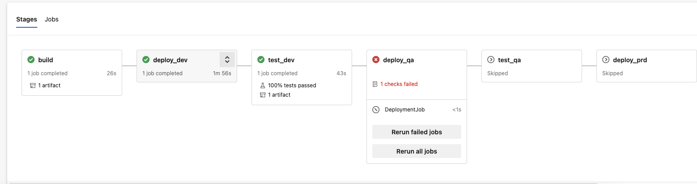

# Engineering Insights - Pipeline Deployment Approvals

## Problem Statement

In our last engagement, we encountered that pipeline deployment [approvals](https://docs.microsoft.com/en-us/azure/devops/pipelines/process/approvals?view=azure-devops&tabs=check-pass) did not work for our use case as expected.

Our objectives were as follows:

- Using the environments resource, setup deployment jobs for each stage: Dev, QA, Prod, etc.
- Give specific users the ability to control when a stage should run and execute the deployments to different environments using approvals.
- Control deployments to specific environments such as production.

Although we were able to fulfill our objectives, the approvals did not work as expected. When a specific user rejects the deployment from going to a particular environment, the entire build is marked as "failed." In these cases, when we do not want to deploy to those environments, there should be an ability for the user in the approval options to mark the stage as "skipped" so that if the rest of the previous stages are successful, it is marked as a successful build.

## Steps to Reproduce

A sample repo has been created [here](https://github.com/Azure-Samples/azure-pipelines-variable-templates) that creates a sample python application with Flask and deploys it to Azure Web App for three different environments, 'dev', 'qa' and 'prd'.

1. Use the steps [here](https://github.com/Azure-Samples/azure-pipelines-variable-templates#running-the-sample) to get started.

2. Create the pipeline in Azure Pipelines using the existing `azure-pipelines.yml` template.

3. [Create a new environment](https://docs.microsoft.com/en-us/azure/devops/pipelines/process/environments?view=azure-devops#create-an-environment). Note: upon running the pipeline for the first time, it will create a new environment for you if it does not already exist.

4. [Add approvals](https://docs.microsoft.com/en-us/azure/devops/pipelines/process/approvals?view=azure-devops&tabs=check-pass#approvals) to allow specific approvers (you can also add yourself) the ability to approve for 'qa' and 'prd' environments.

    - Edit the timeout to be 1 min in the `control options` section on the Approvals setting

5. After changing the environments variables and committing the changes, run the pipeline.

6. Once the 'dev' stage passes, the pipeline will go to the 'deploy_qa' stage and wait for an approval before it can proceed. Run through these two use cases:

    - On the first run, allow the approval to timeout.
    - Re-run the 'deploy_qa' stage and this time reject the approval.

## Actual Results

1. When allowing the approval to timeout, it resulted in that particular stage being skipped. In this case the 'deploy_qa' stage was marked as skipped.

    

2. When the approval was rejected, it caused the stage to fail, resulting in the entire build to be marked as "failed."

    

## Expected Results

On the use case #2 when the approval is rejected, we were expecting for the build to result in a success given that all of the other checks and previous stages had passed. Instead, the build failed which created an impression that something had gone wrong and over time, reflected poorly on the pipeline success rate as well.

Can there be more than 2 options on the approvals to provide a "Reject", "Approve" or "Skipped" which will allow for this use case to take place where the approver can mark the stage as skipped so that the build can be marked as "success".

## Additional Notes

- This use case and issue has been recognized in the [Developer Community](https://developercommunity.visualstudio.com/t/yaml-pipeline-approvals-rejection-fails-build/855198)
